# CISCO-BASIC-DHCP-LAB

A basic Cisco Packet Tracer lab demonstrating DHCP configuration using a router as the DHCP server.

## Topology

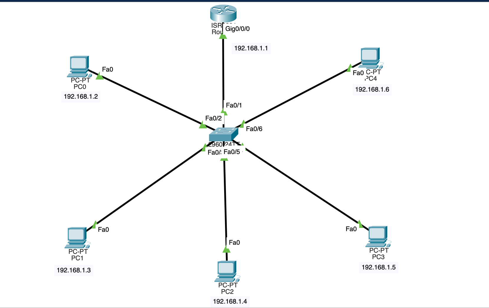

## About This Lab

This lab demonstrates how DHCP can be configured on a Cisco router using Cisco Packet Tracer. The router dynamically assigns IP addresses, subnet masks, default gateway information, and DNS server settings to client PCs on the network.

## Objective

Configure a Cisco router as a DHCP server and automatically assign network settings to client PCs.

## Devices Used in the Topology

* 1 Router
* 1 Switch
* 5 PCs

## IP Addressing Scheme

| Parameter       | Value                        |
| --------------- | ---------------------------- |
| Default Gateway | 192.168.1.1                  |
| DHCP Pool Range | 192.168.1.2 to 192.168.1.254 |
| Subnet Mask     | 255.255.255.0                |
| DNS Server      | 1.1.1.1                      |

## DHCP Configuration

### Excluded Address

The IP address `192.168.1.1` was excluded from the DHCP pool because it is assigned to the router interface and serves as the default gateway for the network.

### Router Configuration

```bash
enable
configure terminal

interface gig0/0/0
ip address 192.168.1.1 255.255.255.0
no shutdown
exit

ip dhcp excluded-address 192.168.1.1

ip dhcp pool LAN
network 192.168.1.0 255.255.255.0
default-router 192.168.1.1
dns-server 1.1.1.1
exit

end
write
```

## PC Configuration

All PCs were configured to obtain network settings automatically through DHCP. The router successfully assigned the following IP addresses:

| Device | IP Address  |
| ------ | ----------- |
| PC0    | 192.168.1.2 |
| PC1    | 192.168.1.3 |
| PC2    | 192.168.1.4 |
| PC3    | 192.168.1.5 |
| PC4    | 192.168.1.6 |

Each client automatically received:

* Subnet Mask: `255.255.255.0`
* Default Gateway: `192.168.1.1`
* DNS Server: `1.1.1.1`

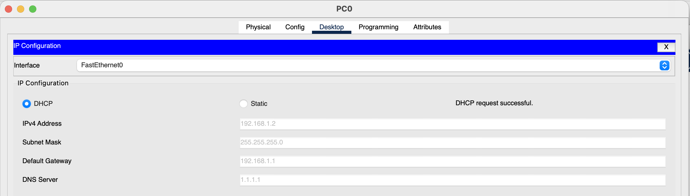

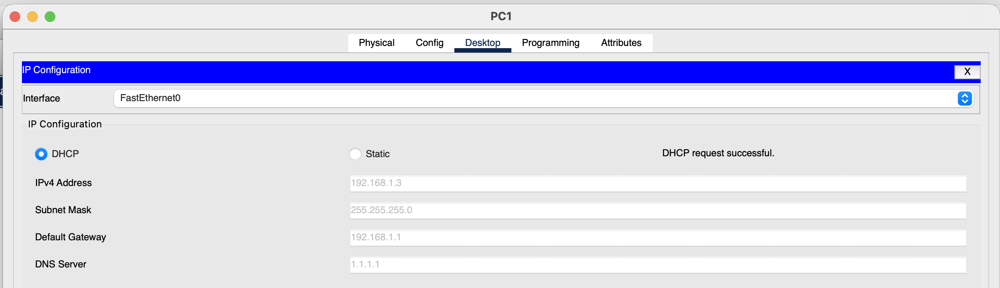

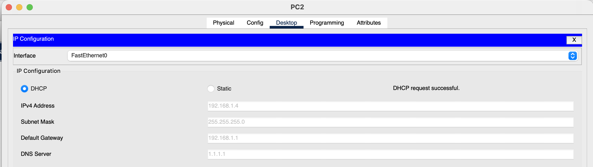

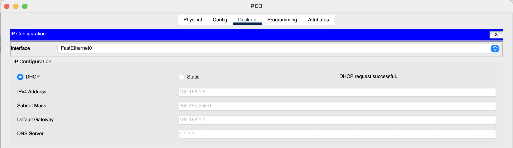

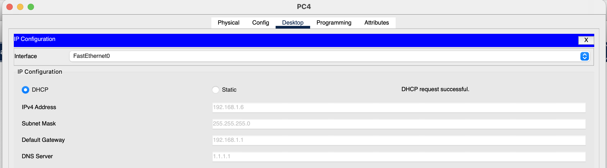

## Verification

The DHCP configuration was verified using the following command:

```bash
show ip dhcp binding
```

The output confirmed that all five PCs successfully received IP addresses from the DHCP pool.

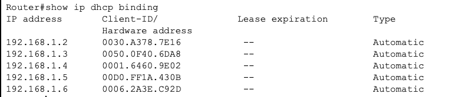

Connectivity was verified using ping tests. PC0 successfully communicated with the other devices on the network, confirming that DHCP configuration and network connectivity were functioning correctly.

* PC0 → PC1

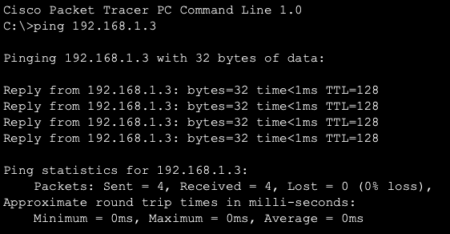

* PC0 → PC2

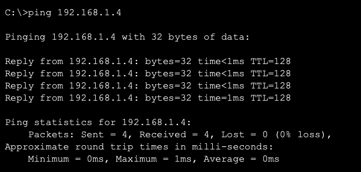

* PC0 → PC3
  
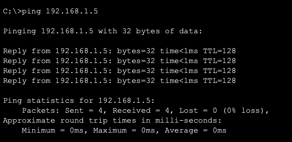

* PC0 → PC4
  
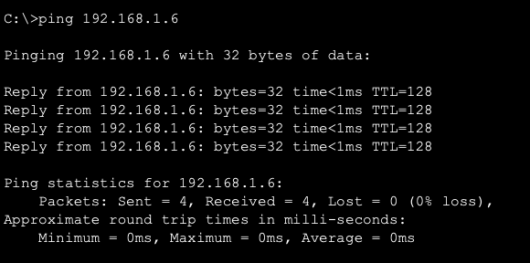


## Result

DHCP was successfully configured using a Cisco router as the DHCP server. The router dynamically assigned IP addresses and network settings to all client devices, while reserving `192.168.1.1` as the default gateway. Verification confirmed that all clients received valid DHCP leases and were able to join the network successfully.

## Tools Used

* Cisco Packet Tracer
* Cisco CLI
